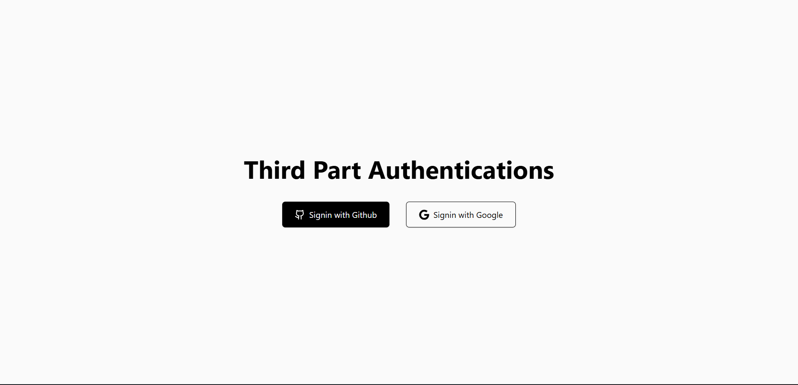

# Third-Party Authentication (GitHub + Google)



This repo contains a minimal full-stack demo for OAuth sign-in with GitHub and Google. The backend handles OAuth flows and redirects; the frontend provides two buttons for login and a success page.

## Features
- GitHub OAuth sign-in
- Google OAuth sign-in
- Simple success page after authentication
- Health check endpoint for the backend

## Tech Stack
- Backend: Node.js, Express, Axios, Dotenv
- Frontend: Next.js (App Router), React, Tailwind CSS, React Icons

## Project Structure
- `backend/` Express server and OAuth handlers
- `frontend/` Next.js UI

## Prerequisites
- Node.js 18+ (recommended)
- GitHub OAuth App credentials
- Google OAuth Client credentials

## Environment Variables (Backend)
Create `backend/.env`:

```env
PORT=4001
GITHUB_CLIENT_ID=your_github_client_id
GITHUB_CLIENT_SECRET=your_github_client_secret
GOOGLE_CLIENT_ID=your_google_client_id
GOOGLE_CLIENT_SECRET=your_google_client_secret
```

## OAuth Callback URLs
Configure these in your provider dashboards:
- GitHub: `http://localhost:4001/auth/github/callback`
- Google: `http://localhost:4001/auth/google/callback`

## Running Locally

### Backend
```bash
cd backend
npm install
npm run dev
```
Backend runs on `http://localhost:4001`.

### Frontend
```bash
cd frontend
npm install
npm run dev
```
Frontend runs on `http://localhost:3000`.

## Available Endpoints (Backend)
- `GET /` Health check
- `GET /auth/github` Start GitHub OAuth
- `GET /auth/github/callback` GitHub OAuth callback
- `GET /auth/google` Start Google OAuth
- `GET /auth/google/callback` Google OAuth callback

## Notes
- The frontend buttons redirect to the backend OAuth endpoints.
- After successful authentication, the backend redirects to `http://localhost:3000/success`.

## License
ISC
